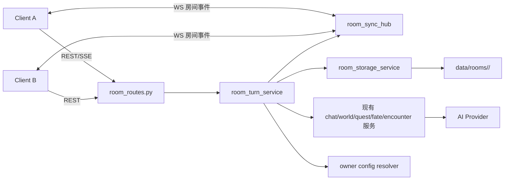

# 多人房间与实时同步技术方案（2026-03-15）

更新日期：`2026-03-15`

## 1. 目标
- 在当前单机/单存档原型之上，增加“房间制多人游玩”能力。
- 保留现有玩法核心：地图、公开场景、任务、命运、遭遇、日志、阻塞式模态优先级。
- 让多个已登录用户进入同一房间，共用同一份世界状态、同一条公开聊天时间线、同一套 AI 配置。
- 方案优先追求“能在当前代码基线上演进落地”，不追求一步到位的 MMO 架构。

## 2. 基线判断

### 2.1 已有可复用能力
- 账号体系已存在，服务端可从 Cookie 恢复当前用户：`auth_routes.py`、`core/auth.py`、`main.py`。
- 单回合 AI 生成、SSE 流式输出、待续回合、检定中断恢复已存在。
- 公开场景、任务、命运、遭遇、日志、地图、队伍系统已形成共享世界玩法雏形。
- 前端已经具备阻塞式任务/遭遇模态和较完整的状态同步入口。

### 2.2 当前不适合直接复用的点
- 存档路径按用户分目录：`data/users/<username>/current-save.json`，天然是“每用户一份存档”。
- `session_lock_service.py` 当前锁粒度是 `(user, session_id)`，不是房间级。
- `SaveFile` 只包含一名玩家：`player_static_data`、`player_runtime_data`。
- `area_snapshot`、`map_snapshot.player_position`、任务追踪、遭遇活跃态都隐含“单玩家驱动”。

## 3. 核心决策

### 3.1 房间模型
- 采用“房间制 + 共享世界 + 共享公开聊天”。
- 一个房间对应一份权威世界状态。
- 房间中的所有玩家默认属于同一支冒险队，默认共享当前区域/子区域。
- 房间内仍允许保留 NPC 队友系统，但人类玩家不并入 `team_state`。

### 3.2 并发模型
- V1 不做并行世界推进。
- 房间内同一时刻只允许一个公开回合进入“运行中 / 等待检定 / 等待模态决策”状态。
- 这与当前单回合、阻塞模态、待续回合设计一致，能最大限度复用现有服务。

### 3.3 通信模型
- 命令面继续使用 `REST`。
- 主动发起公开回合的客户端继续使用现有 `SSE` 体验流式生成。
- 房间内所有成员新增 `WebSocket` 订阅房间事件，用于在线人数、公开聊天、状态变更广播。
- 结论：采用 `REST + SSE + WebSocket` 混合方案，而不是一次性把全部通道改成 WebSocket。

### 3.4 共享 API 模型
- 房间默认采用“房主共享 API 配置”。
- 房间只保存房主配置的引用与可公开参数，不复制 API Key 到房间目录。
- 其他玩家只看到 provider / model / runtime，不可读取密钥。

## 4. 范围与非目标

### 4.1 V1 范围
- 创建房间、加入房间、离开房间、房间成员列表、在线状态。
- 公开聊天和共享日志。
- 共用地图、共用任务、共用命运、共用遭遇、共用公共场景推进。
- 房主共享 AI 配置。
- 断线重连后的快照恢复与事件补拉。

### 4.2 明确不做
- 分队行动或不同玩家位于不同子区域。
- 多名玩家同时并发提交会改变世界的动作。
- 房间内投票式任务接单/拒单。
- 玩家与 NPC 的独立私聊线程并行推进世界。
- 多后端实例分布式部署；V1 默认单进程单实例。

## 5. 目标架构



## 6. 数据模型设计

### 6.1 新增聚合根：`RoomState`
建议不要直接把多人字段硬塞进当前 `SaveFile` 顶层后立刻改全站逻辑。更稳妥的做法是新增房间聚合根：

```ts
type RoomState = {
  version: string;
  room_id: string;
  room_revision: number;
  status: 'lobby' | 'active' | 'archived';
  owner_username: string;
  shared_state: RoomSharedState;
  players: RoomPlayerState[];
  runtime: RoomRuntimeState;
  updated_at: string;
};
```

### 6.2 `RoomSharedState`
`RoomSharedState` 承载房间共享世界，基本等同于“去掉单玩家字段后的 SaveFile”：
- `world_state`
- `map_snapshot`
- `area_snapshot`
- `game_logs`
- `game_log_settings`
- `role_pool`
- `team_state`
- `reputation_state`
- `zone_metric_state`
- `travel_companion_state`
- `quest_state`
- `encounter_state`
- `fate_state`

说明：
- `team_state` 仍只表示 NPC 队友，不表示人类房间成员。
- `area_snapshot` 和地图位置在 V1 维持房间级唯一位置。

### 6.3 `RoomPlayerState`
每名人类玩家单独保存角色状态：

```ts
type RoomPlayerState = {
  player_id: string;
  username: string;
  display_name: string;
  seat_status: 'joined' | 'left' | 'kicked';
  room_role: 'owner' | 'member';
  static_data: PlayerStaticData;
  runtime_data: PlayerRuntimeData;
  permissions: {
    can_submit_turn: boolean;
    can_resolve_modal: boolean;
  };
  joined_at: string;
  updated_at: string;
};
```

关键决策：
- 角色数据以“房间内副本”为准，不直接引用账号级角色。
- 用户可在加入房间时从个人模板导入一份角色卡，但进入房间后由房间状态独立持久化。

### 6.4 `RoomRuntimeState`
运行态负责锁、模态和同步：

```ts
type RoomRuntimeState = {
  active_turn_id: string | null;
  active_turn_status: 'idle' | 'running' | 'awaiting_reaction' | 'awaiting_modal';
  acting_player_id: string | null;
  blocking_modal: {
    kind: 'quest' | 'fate' | 'encounter' | 'reaction_check' | null;
    target_player_id: string | null;
    target_scope: 'room' | 'player' | null;
    reference_id: string | null;
  };
  ai_binding: RoomAiBinding;
  last_event_id: string | null;
};
```

### 6.5 `RoomAiBinding`

```ts
type RoomAiBinding = {
  mode: 'owner_profile';
  owner_username: string;
  provider: 'openai' | 'deepseek' | 'gemini';
  model: string;
  runtime: AppRuntimeConfig;
  enabled: boolean;
  token_budget_daily?: number | null;
  token_budget_monthly?: number | null;
};
```

说明：
- 房间只保存绑定关系和公开参数。
- 实际 `api_key` 运行时从 `data/users/<owner>/config.json` 读取。
- 房主修改个人配置后，房间下一个回合自动使用新配置。

## 7. 与现有 `SaveFile` 的衔接

### 7.1 不建议第一步全量重写所有服务
当前服务大量依赖：
- `save.player_static_data`
- `save.player_runtime_data`
- `save.session_id`

如果一步改成多玩家，改动面会非常大。

### 7.2 建议增加“演员视图适配层”
新增适配函数：

```py
build_actor_save_view(room_state, player_id, session_id) -> SaveFile
apply_actor_save_diff(room_state, actor_save_before, actor_save_after, player_id) -> RoomState
```

行为：
- 在回合开始时，把房间共享态和当前玩家数据临时拼成一个 `SaveFile` 视图。
- 复用现有 `chat_service`、`world_service`、`quest_service`、`encounter_service`。
- 回合结束后，把变化拆回 `RoomSharedState` 与对应 `RoomPlayerState`。

收益：
- 多人第一阶段不需要重写全部玩法服务。
- 后续再逐步把服务签名从 `session_id + SaveFile` 迁移为 `room_id + actor_context`。

## 8. 存储设计

### 8.1 目录结构

```txt
data/
  rooms/
    <room_id>/
      meta.json
      members.json
      room-state.bundle/
        manifest.json
        shared_state.json
        players.json
        runtime.json
      events.jsonl
```

### 8.2 文件职责
- `meta.json`：房间标题、房主、邀请码、创建时间、状态。
- `members.json`：成员清单、权限、最近在线时间。
- `room-state.bundle/*`：当前权威房间状态。
- `events.jsonl`：按 revision 追加的事件流，用于重连补拉和审计。

### 8.3 与现有存档并存
- 保留当前 `data/users/<username>/current-save.json`，继续支持单人模式。
- 多人房间状态独立存入 `data/rooms/`。
- 单人模式和多人模式可以长期并存，不需要立刻迁移旧档。

## 9. 房间 API 设计

### 9.1 房间与成员
- `POST /api/v1/rooms`
- `GET /api/v1/rooms`
- `GET /api/v1/rooms/{room_id}`
- `POST /api/v1/rooms/{room_id}/join`
- `POST /api/v1/rooms/{room_id}/leave`
- `POST /api/v1/rooms/{room_id}/kick`
- `POST /api/v1/rooms/{room_id}/ownership/transfer`

### 9.2 快照与事件
- `GET /api/v1/rooms/{room_id}/snapshot`
- `GET /api/v1/rooms/{room_id}/events?after_revision=123`
- `WS /api/v1/rooms/{room_id}/ws`

### 9.3 共享 AI 配置
- `GET /api/v1/rooms/{room_id}/ai-binding`
- `POST /api/v1/rooms/{room_id}/ai-binding`
- `POST /api/v1/rooms/{room_id}/ai-binding/validate`

### 9.4 公开聊天与回合
- `POST /api/v1/rooms/{room_id}/chat/public`
- `POST /api/v1/rooms/{room_id}/chat/public/stream`
- `POST /api/v1/rooms/{room_id}/turns/{turn_id}/reaction`
- `POST /api/v1/rooms/{room_id}/turns/{turn_id}/cancel`

### 9.5 共享玩法动作
房间路由层只做鉴权和房间上下文包装，内部继续调用现有服务：
- `POST /api/v1/rooms/{room_id}/world/move-sub-zone`
- `POST /api/v1/rooms/{room_id}/quests/{quest_id}/accept`
- `POST /api/v1/rooms/{room_id}/quests/{quest_id}/reject`
- `POST /api/v1/rooms/{room_id}/encounters/present`
- `POST /api/v1/rooms/{room_id}/encounters/act`
- `POST /api/v1/rooms/{room_id}/fate/evaluate`

## 10. 事件与同步协议

### 10.1 事件原则
- 以后端房间状态为唯一权威源。
- 客户端不做 CRDT，不做双写合并。
- 每次成功提交都会生成递增 `room_revision`。
- 客户端基于 `room_revision` 顺序应用事件；缺洞时回退到快照拉取。

### 10.2 事件类型建议
- `room.snapshot`
- `room.member_joined`
- `room.member_left`
- `room.presence_updated`
- `room.turn_started`
- `room.turn_streaming`
- `room.turn_committed`
- `room.turn_rolled_back`
- `room.chat_message_added`
- `room.scene_event_added`
- `room.modal_updated`
- `room.state_updated`

### 10.3 `room.state_updated` 负载
不建议第一版做 JSON Patch。建议用粗粒度分片：

```json
{
  "room_revision": 42,
  "changed_scopes": [
    "shared_state.area_snapshot",
    "shared_state.quest_state",
    "players.player_002.runtime_data"
  ],
  "shared_state": {
    "area_snapshot": {},
    "quest_state": {}
  },
  "players": {
    "player_002": {
      "runtime_data": {}
    }
  }
}
```

这样前端实现难度明显低于 JSON Patch，也比整房间全量快照更省。

## 11. 公开聊天设计

### 11.1 统一公开时间线
房间主界面采用一条公开时间线，混排：
- 玩家公开发言
- 玩家公开动作
- GM 回合回复
- `scene_events`
- 任务/遭遇反馈
- 系统通知

### 11.2 消息结构

```ts
type RoomChatMessage = {
  message_id: string;
  room_id: string;
  room_revision: number;
  author_type: 'player' | 'gm' | 'system';
  author_id: string;
  author_name: string;
  visibility: 'public';
  content: string;
  payload_kind: 'speech' | 'action' | 'action_and_speech' | 'gm_reply' | 'system_notice';
  created_at: string;
};
```

### 11.3 与现有主聊天兼容
- 当前主聊天支持动作和语言双输入。
- 多人 V1 继续保留这个输入模型。
- 区别只是：提交者从“单个 session 玩家”变为“房间中的某个 player_id”。

## 12. 模态与优先级

### 12.1 保留现有 UX 规则
- 所有房间级任务/命运/遭遇模态继续阻塞公开聊天。
- 优先级保持：`命运任务/普通任务 > 遭遇`。
- 遭遇正文和结算全文继续写入房间日志。

### 12.2 多人下的决策权限
- 模态仍对整个房间可见。
- 但只有被授权的玩家可以点击确认。
- 其他玩家显示只读状态，例如“等待队长确认任务”。

### 12.3 V1 决策策略
- `fate` 默认由房主或指定主角处理。
- 普通任务默认由触发玩家处理；若未指定，则由房主处理。
- 遭遇中的反应检定默认由本回合动作发起者处理。

不建议 V1 引入投票，否则会显著抬高状态机复杂度。

## 13. 锁与回合生命周期

### 13.1 新锁模型
新增房间级锁服务：
- `get_room_state_lock(room_id)`：保护房间状态读写。
- `get_room_turn_guard(room_id)`：保护“同一时刻只有一个回合运行”。

现有 `get_session_lock(session_id)` 不再适合作为多人主锁。

### 13.2 回合执行流程
1. 校验当前用户是房间成员，且绑定了 `player_id`。
2. 原子设置 `runtime.active_turn_id` 和 `runtime.acting_player_id`。
3. 生成 actor save view。
4. 在不持久占用房间写锁的情况下运行 AI 与现有玩法服务。
5. 回调提交时重新加房间锁，校验房间 revision 未失配。
6. 写入共享状态、玩家状态、日志、事件流。
7. 广播 `turn_committed` 与 `state_updated`。

### 13.3 反应检定/待续回合
- 当前 `PendingTurnState` 是 `session_id` 作用域。
- 多人后改成 `room_id + turn_id` 作用域，并新增 `target_player_id`。
- 房间内其余玩家只能旁观，不能替代目标玩家掷骰，除非房主强制接管。

## 14. 共享 API 方案

### 14.1 推荐方案
- 房主在创建房间时选择“使用我的配置作为房间 AI”。
- 房间只存：
  - 房主用户名
  - provider
  - model
  - runtime
  - 预算上限
- 真正的 `api_key` 仍在房主个人配置中。

### 14.2 权限规则
- 只有房主可修改房间 AI 绑定。
- 普通成员只能查看房间当前使用的 provider/model。
- 若房主的个人配置缺失或失效，房间进入 `ai_unavailable` 状态，禁止新回合提交。

### 14.3 为什么不直接把 API Key 复制进房间
- 会扩大密钥暴露面。
- 房间导出/备份时容易泄漏。
- 与当前“用户本地配置”体系不一致。

## 15. 前端落地建议

### 15.1 路由与状态
- 新增房间大厅页：房间列表、创建、加入。
- 聊天页从 `sessionId` 驱动改为 `roomId + playerId + sessionId` 共同驱动。
- `sessionId` 保留给当前浏览器标签页，用于流式请求与取消。

### 15.2 新前端模块
- `RoomLobbyPanel`
- `RoomPresenceBar`
- `RoomMemberList`
- `useRoomSocket`
- `roomApi.ts`

### 15.3 现有页面复用
- `App.tsx` 仍可作为主玩法页。
- 任务、遭遇、日志、地图、角色卡组件尽量继续复用。
- 核心改动集中在顶部房间上下文、公开聊天来源、以及状态同步入口。

## 16. 后端落地建议

### 16.1 新模块
- `backend/app/api/room_routes.py`
- `backend/app/services/room_service.py`
- `backend/app/services/room_storage_service.py`
- `backend/app/services/room_sync_service.py`
- `backend/app/services/room_turn_service.py`
- `backend/app/services/room_ai_binding_service.py`

### 16.2 现有模块改造点
- `main.py`：挂载 WebSocket 路由。
- `session_lock_service.py`：增加房间级锁。
- `core/storage.py`：新增房间目录解析，不污染现有用户存档路径逻辑。
- `schemas.py`：新增 `Room*` 系列模型，或拆分到 `room_schemas.py`。

## 17. 实施顺序

### P0 房间骨架
- 房间模型、房间目录、创建/加入/离开 API。
- 房间成员鉴权。
- `room_id` 作用域的快照读取。

### P1 实时同步
- WebSocket 房间广播。
- 在线成员与事件回放。
- 前端房间大厅与房间进入流程。

### P2 公开聊天
- 房间公开聊天接口。
- 房间级回合锁。
- 房间事件流与统一公开时间线。
- 房主共享 AI 绑定。

### P3 玩法接入
- 任务、命运、遭遇、日志改成房间级。
- `PendingTurnState` 改成房间级。
- 角色卡与检定指向 `player_id`。

### P4 稳定性
- 断线重连补拉。
- revision 缺口恢复。
- 多客户端集成测试。

## 18. 验收标准
- 两个已登录用户可以进入同一房间并看到同一条公开时间线。
- 任一成员提交公开动作后，其他成员能在 1 个广播周期内看到结果。
- 房间内同一时刻只能有一个公开回合在运行。
- 任务/命运/遭遇模态在多人下仍按现有优先级阻塞公开聊天。
- 房间共享 AI 配置不会把房主 API Key 下发到其他客户端。
- 断线重连后客户端能通过快照 + events 恢复到最新 `room_revision`。

## 19. 主要风险
- 当前大量服务默认单玩家，适配层实现不好会导致状态回写错误。
- 任务/遭遇/检定的“由谁决策”如果规则不明确，会让多人体验卡住。
- 如果同时要求“多人实时自由聊天”和“所有输入都推进世界”，串行回合会变得拥堵。

## 20. 建议结论
- 建议把多人模式定义为“共享世界房间”，不是“多个单机存档互相可见”。
- 建议保留当前单人模式，不做破坏式替换。
- 建议优先落“房间 + 房主共享 AI + 统一公开时间线 + 房间级锁 + WebSocket 同步”。
- 建议把“分队行动、投票决策、并发私聊、分布式广播”全部放到后续阶段。
